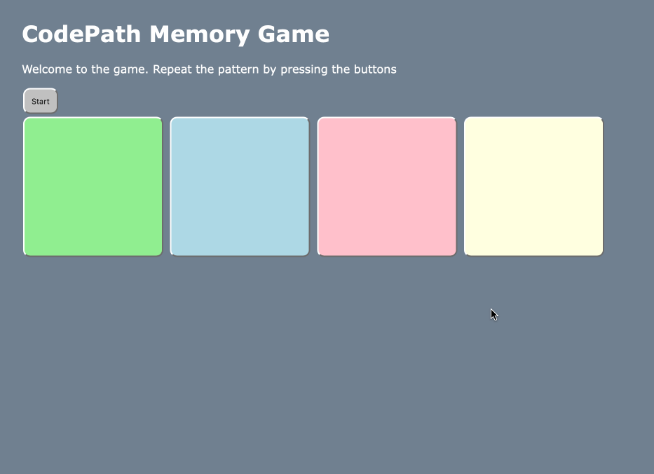
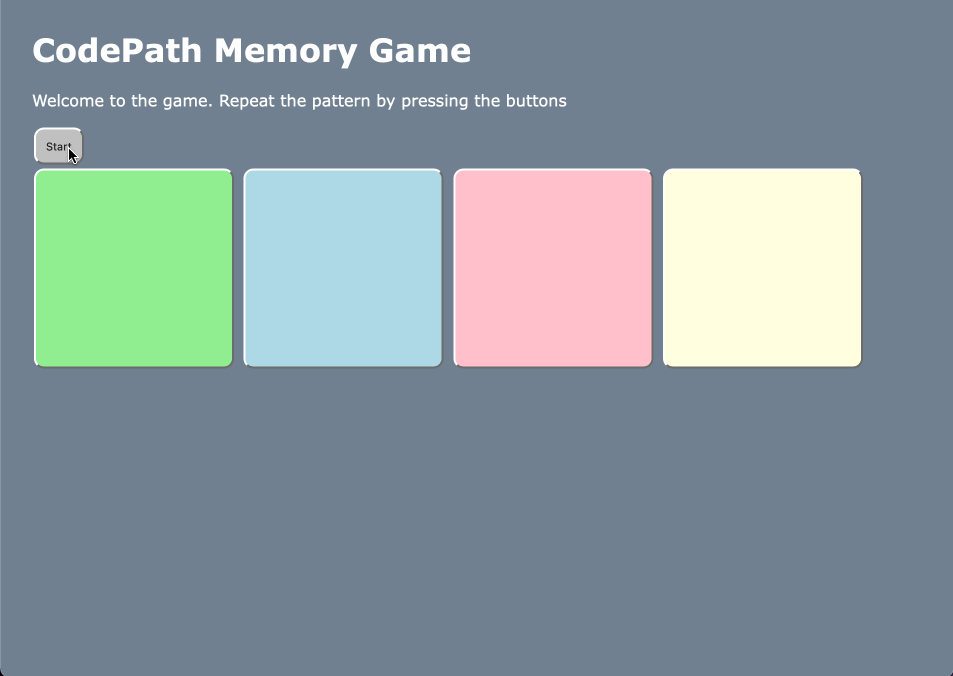

# Pre-work - *Memory Game*

**Memory Game** is a Light & Sound Memory game to apply for CodePath's SITE Program. 

Submitted by: **Rezaur Khan**

Time spent: **2** hours spent in total

Link to project: (https://glitch.com/edit/#!/motley-humane-string)

## Required Functionality

The following **required** functionality is complete:

* [x] Game interface has a heading (h1 tag), a line of body text (p tag), and four buttons that match the demo app
* [x] "Start" button toggles between "Start" and "Stop" when clicked. 
* [x] Game buttons each light up and play a sound when clicked. 
* [x] Computer plays back sequence of clues including sound and visual cue for each button
* [x] Play progresses to the next turn (the user gets the next step in the pattern) after a correct guess. 
* [x] User wins the game after guessing a complete pattern
* [x] User loses the game after an incorrect guess

The following **optional** features are implemented:

* [ ] Any HTML page elements (including game buttons) has been styled differently than in the tutorial
* [ ] Buttons use a pitch (frequency) other than the ones in the tutorial
* [ ] More than 4 functional game buttons
* [ ] Playback speeds up on each turn
* [ ] Computer picks a different pattern each time the game is played
* [ ] Player only loses after 3 mistakes (instead of on the first mistake)
* [ ] Game button appearance change goes beyond color (e.g. add an image)
* [ ] Game button sound is more complex than a single tone (e.g. an audio file, a chord, a sequence of multiple tones)
* [ ] User has a limited amount of time to enter their guess on each turn

The following **additional** features are implemented:

- [ ] List anything else that you can get done to improve the app!

## Video Walkthrough (GIF)

If you recorded multiple GIFs for all the implemented features, you can add them here:

## Reflection Questions
1. If you used any outside resources to help complete your submission (websites, books, people, etc) list them here. 

I have not used any outside resources to assist me in this project

2. What was a challenge you encountered in creating this submission (be specific)? How did you overcome it? (recommended 200 - 400 words) 

A challenge I encountered in creating this submission would be 

3. What questions about web development do you have after completing your submission? (recommended 100 - 300 words) 

Much of my experience in web development comes with front-end. A question I have after completeingn this submission is how can I implement backend to add features to this game. My guess would be we could do things like make this game unique to each person like creating a log in system. Or maybe backend could be used to create a scoreboard system that displays the highest scorers. Completeing this submission made me curious on how exactly do front-end and back-end integrate with each other? As for the information needed to create a scoreboard, where exactly would the information be stored?

4. If you had a few more hours to work on this project, what would you spend them doing (for example: refactoring certain functions, adding additional features, etc). Be specific. (recommended 100 - 300 words) 

If I had more hours to do this project, I would implement React to introduce composabilty to this project. This would make it easier to add more colored squares componenets if we were to,say,introduce difficulty modes. The harder the difficulty mode, the more colored squares. React would allow us to use a feature called "state" to conditionally render the amount of colored square based on difficulty. I would also make the patterns random instead of having a preset array of patterns for the computer. This would make this game more challenging. Last but not least, I would add a competitive aspect for this game by creating a scoring system and recording the scores everytime a game is played. This would possibly need backend, which im not too proficient in, but as always, I am willing to learn. 

## Interview Recording URL Link

[My 5-minute Interview Recording](your-link-here)

## License

    Copyright [Rezaur Khan]

    Licensed under the Apache License, Version 2.0 (the "License");
    you may not use this file except in compliance with the License.
    You may obtain a copy of the License at

        http://www.apache.org/licenses/LICENSE-2.0

    Unless required by applicable law or agreed to in writing, software
    distributed under the License is distributed on an "AS IS" BASIS,
    WITHOUT WARRANTIES OR CONDITIONS OF ANY KIND, either express or implied.
    See the License for the specific language governing permissions and
    limitations under the License.
